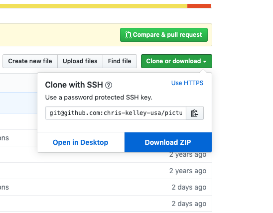
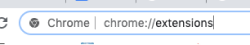
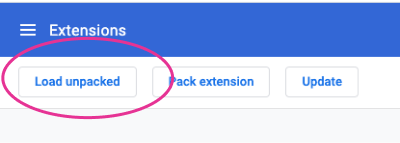
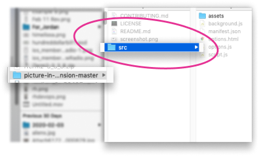
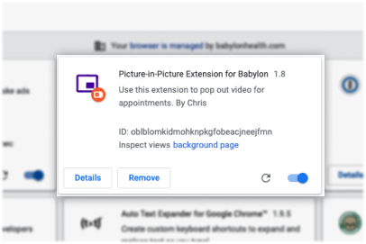
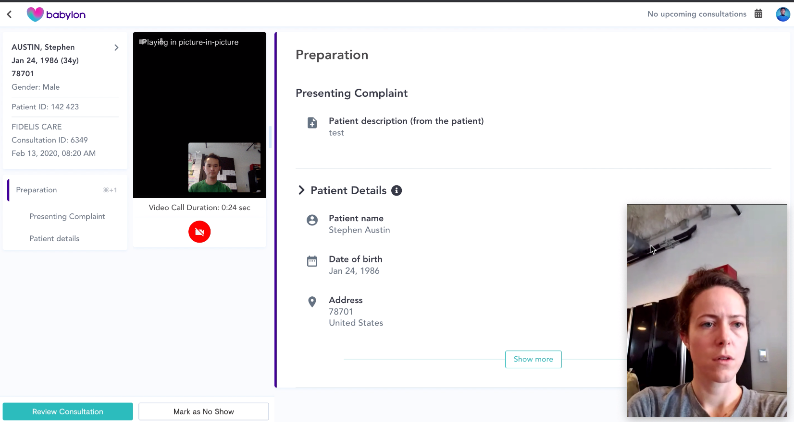

# Picture-in-Picture Chrome Extension

*Forked from Google's Github*

A simple Chrome Extension to demonstrate the [Picture-in-Picture Web API](https://wicg.github.io/picture-in-picture/) in Chrome.

## Installation Instructions 
1. Download this repository as a Zip.  
  
2. Unzip and note folder name and path  
3. Open Chrome  
4. Go to `chrome://extensions`  
  
5. If not enabled, enable "Developer Mode" using the switch in the top right corner  
  
6. Click "Load unpacked" on the left of the new bar that appears  
  
7. Select the unzipped folder, then select the folder titled `src`. Click open or select.  
  
8. Voilà!   
   

### Screenshot

### Configuration

The keyboard shortcut (defaults to `Alt-P`) can be changed on the
Chrome Extension Shortcuts settings page:
chrome://extensions/shortcuts
